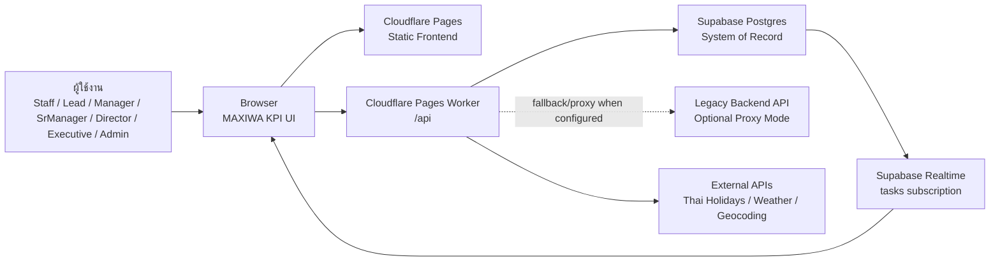
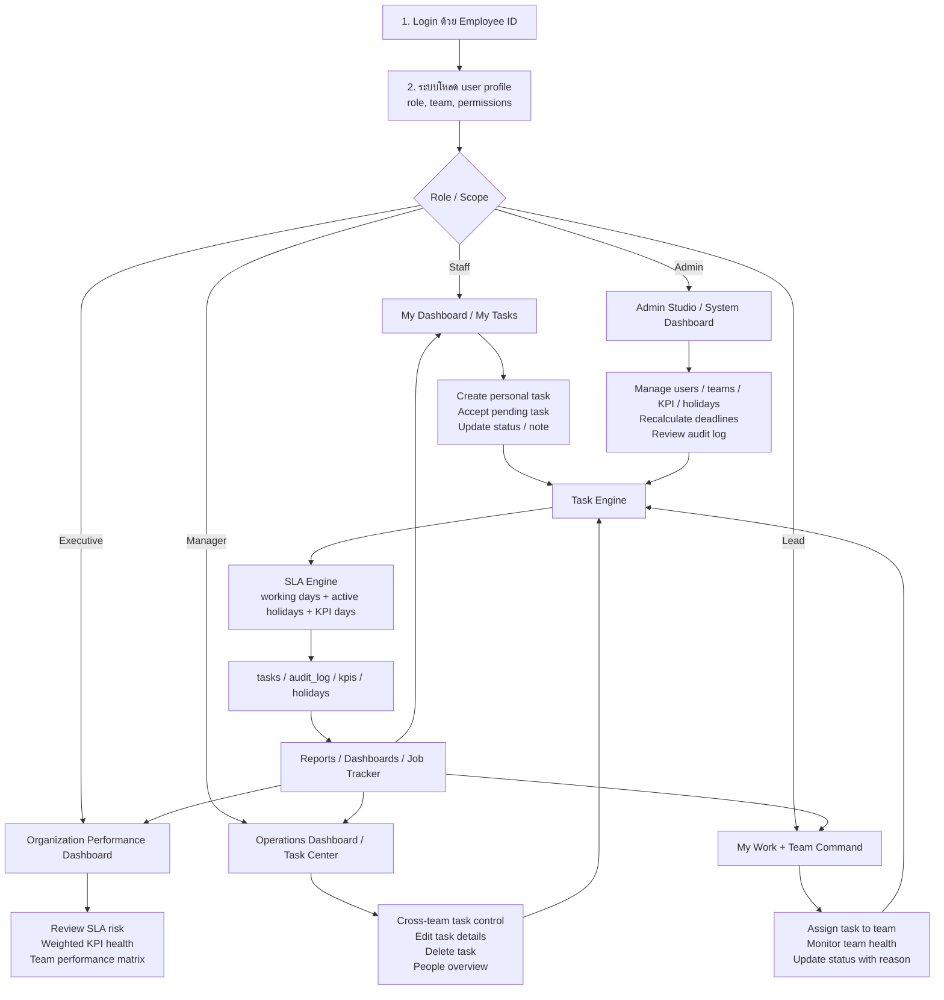
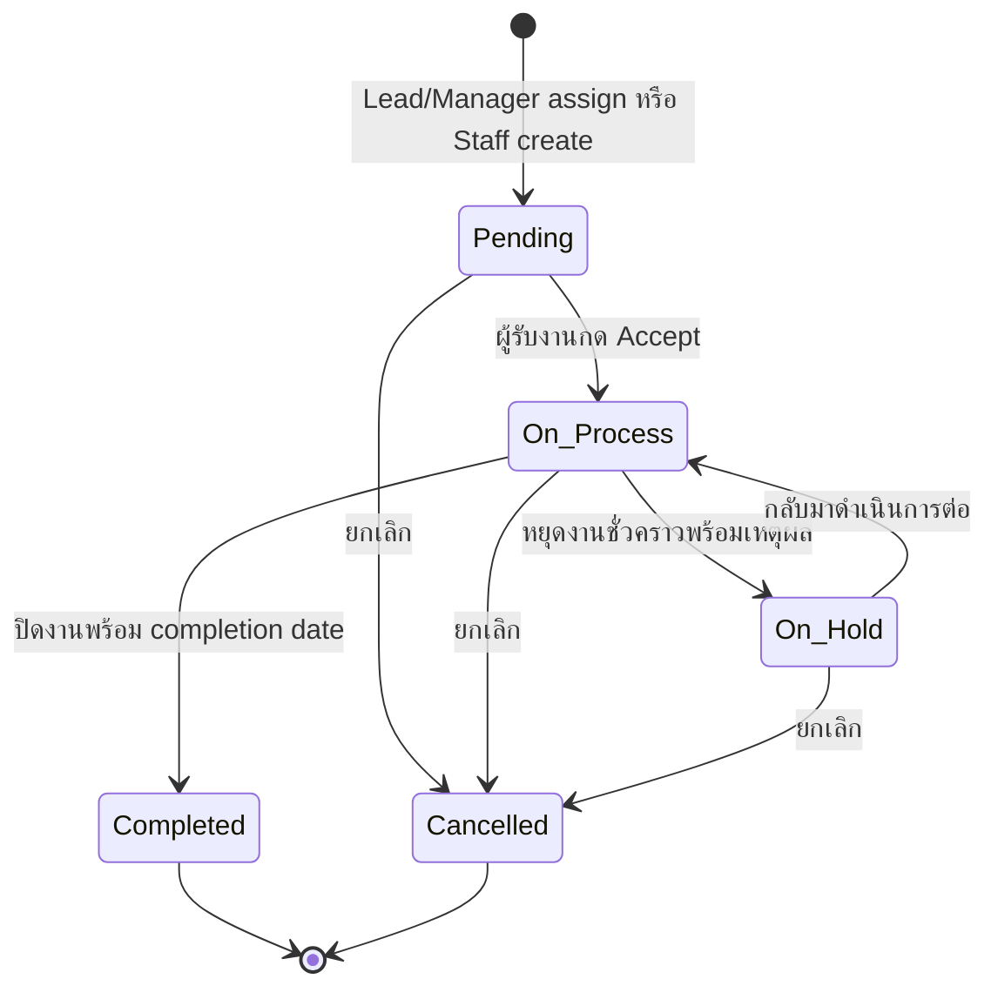
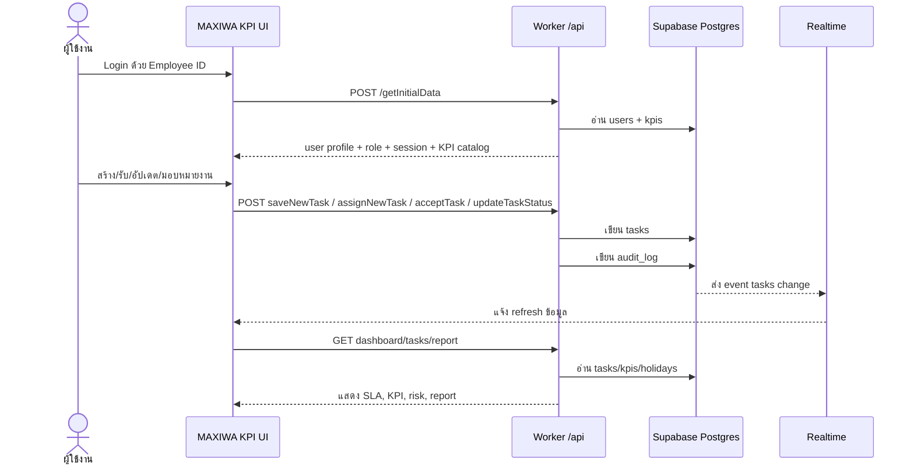

# MAXIWA KPI: ไดอะแกรมการทำงานและทรัพยากรที่ต้องใช้

เอกสารนี้สรุปภาพรวมระบบ MAXIWA KPI สำหรับนำเสนอผู้บริหาร โดยเน้น 4 เรื่องหลัก: ระบบทำอะไร, ผู้ใช้แต่ละระดับทำงานอย่างไร, ข้อมูลไหลผ่านจุดใดบ้าง, และต้องใช้ทรัพยากรอะไรในการเปิดใช้งาน/ดูแลระบบ

## 1. Executive Summary

MAXIWA KPI เป็นระบบติดตามงาน SLA/KPI รุ่นใหม่ที่ออกแบบให้ผู้บริหารเห็นสุขภาพการดำเนินงานได้เร็วขึ้น โดยยังคงใช้ backend, route, และโครงสร้างฐานข้อมูลเดิมสำหรับ Release 1 เพื่อลดความเสี่ยงในการเปลี่ยนระบบ

เป้าหมายเชิงธุรกิจ:
- เห็นภาพรวม SLA, KPI, งานเสี่ยงหลุดกำหนด, งานค้าง และผลงานรายทีม/รายบุคคลในมุมเดียว
- ให้ Staff, Lead, Manager, Executive และ Admin ทำงานตามสิทธิ์ของตนเองในระบบเดียว
- ลดการพึ่งพาการแก้ข้อมูลตรงในฐานข้อมูล เพราะ Admin สามารถจัดการผู้ใช้ ทีม KPI วันหยุด และ audit log ผ่าน UI
- รองรับการ deploy บน Cloudflare Pages พร้อม Worker API ที่ต่อ Supabase โดยตรง หรือ proxy ไป backend เดิมได้

## 2. ภาพรวมสถาปัตยกรรมระบบ

สาระสำคัญ:
- Frontend ถูก build เป็น static files และ deploy ผ่าน Cloudflare Pages
- Browser เรียก API ที่ `/api`
- Worker ทำหน้าที่เป็น backend facade: อ่าน/เขียน Supabase หรือส่งต่อไป legacy backend
- Supabase Postgres เป็นแหล่งข้อมูลหลักสำหรับตารางงาน ผู้ใช้ ทีม KPI วันหยุด และ audit
- Realtime ใช้กับตาราง `tasks` เพื่อ refresh งานเมื่อมีการเปลี่ยนแปลง

## 3. Workflow การทำงานหลัก

## 4. Workflow วงจรชีวิตงาน

กติกาสำคัญ:
- Deadline คำนวณจาก KPI days + start date + วันทำการ โดยตัด weekend และ active holidays
- เมื่อ KPI หรือวันหยุดเปลี่ยน Admin สามารถสั่ง recalculate deadlines ได้
- ทุก action สำคัญควรมี audit log เพื่อใช้ตรวจสอบย้อนหลัง

## 5. ลำดับการไหลของข้อมูล

## 6. Module และหน้าจอหลัก

| Module | ผู้ใช้หลัก | ใช้ทำอะไร | ข้อมูลหลัก |
|---|---|---|---|
| Login / Identity | ทุก role | เข้าระบบด้วย Employee ID และโหลดสิทธิ์ | `users`, session headers |
| My Work | Staff, Lead | ดูงานตัวเอง รับงาน อัปเดตสถานะ เพิ่ม note | `tasks`, `kpis`, `holidays` |
| Team Command | Lead | ดูสุขภาพทีม มอบหมายงาน ติดตามสมาชิก | `tasks`, `users`, `teams` |
| Task Center | Lead, Manager, Admin | ค้นหา กรอง แก้ไข ลบ และติดตามงาน | `tasks`, `audit_log` |
| Performance Dashboard | Manager, SrManager, Director, Executive | ดู SLA risk, weighted KPI, team matrix | `tasks`, `kpis`, `holidays` |
| People Overview | Lead, Manager, Executive | ดู performance รายบุคคล/ทีมตามสิทธิ์ | `users`, `tasks` |
| Job Tracker | ทุก role ตามสิทธิ์ | ค้นหางานตาม job code, ดู timeline และ duplicate signals | `tasks`, `audit_log` |
| Admin Studio | Admin | จัดการผู้ใช้ ทีม KPI วันหยุด ลิงก์ระบบ ประกาศ และ audit | `users`, `teams`, `kpis`, `holidays`, `audit_log`, `app_system_links` |

## 7. ทรัพยากรที่ต้องใช้

### 7.1 Technical Resources

| หมวด | รายการที่ต้องใช้ | บทบาทต่อระบบ |
|---|---|---|
| Hosting | Cloudflare Pages project | ให้บริการ frontend static files และ Pages Worker |
| Runtime API | Cloudflare Pages Worker ที่ path `/api` | ทำหน้าที่ API facade, Supabase connector, หรือ legacy proxy |
| Database | Supabase Postgres | System of record สำหรับ users, teams, kpis, tasks, holidays, audit_log |
| Realtime | Supabase Realtime | แจ้ง UI ให้ refresh เมื่อ `tasks` เปลี่ยน |
| Secrets | `SUPABASE_URL`, `SUPABASE_SERVICE_ROLE_KEY`, `SUPABASE_ANON_KEY` หรือ `MAXIWA_*` | ให้ Worker อ่าน/เขียน Supabase และให้ browser ใช้ realtime/public config |
| Legacy Integration | `MAXIWA_BACKEND_API_BASE` | ใช้เมื่อเลือก proxy ไป backend เดิมแทน Supabase-backed API |
| Build Tooling | Node.js, npm, Tailwind CSS, Wrangler | build, local dev, และ deploy |
| Optional External APIs | Thai holiday API, weather/geocoding APIs | ใช้กับ holiday sync/weather widgets ตาม config |

### 7.2 Data Resources

| ตาราง/ข้อมูล | ใช้สำหรับ | เจ้าของข้อมูลที่ควรกำหนด |
|---|---|---|
| `users` | employee profile, role, team, permissions | HR / Admin ระบบ |
| `teams` | catalog ทีม | Business owner / Admin |
| `kpis` | main KPI, sub KPI, SLA days, weight | Operations / KPI owner |
| `tasks` | งานจริง สถานะ deadline completion note extra data | ผู้ใช้งานตาม role |
| `holidays` | วันหยุดที่ใช้คำนวณ SLA | Admin / Operations |
| `audit_log` | ประวัติการเปลี่ยนแปลงงานและ admin action | System / Compliance owner |
| `app_system_links` | ลิงก์ระบบงานอื่นตามสิทธิ์ | Admin / IT owner |

### 7.3 People / Operating Resources

| บทบาท | ความรับผิดชอบ |
|---|---|
| Executive Sponsor | ตัดสินใจทิศทาง rollout, KPI governance, adoption target |
| Product Owner / Operations Owner | กำหนด workflow, KPI logic, UAT acceptance |
| Admin ระบบ | ดูแล user/team/KPI/holiday/audit ผ่าน Admin Studio |
| IT / Cloudflare Owner | ดูแล deploy, secrets, domain, access, monitoring |
| Database Owner | ดูแล Supabase project, backup, performance, security policy |
| UAT Leads | ทดสอบเทียบระบบเดิม, ตรวจ feature parity, ยืนยันข้อมูลราย role |
| Support / Trainer | ทำคู่มือสั้น อบรมผู้ใช้ และรับ feedback หลัง go-live |

## 8. สิ่งที่ต้องเตรียมก่อนนำขึ้นใช้งาน

| ลำดับ | รายการ | สถานะจาก repo ปัจจุบัน |
|---|---|---|
| 1 | Build/deploy structure สำหรับ Cloudflare Pages | พร้อมใช้งาน |
| 2 | Runtime API target `/api` | พร้อมใช้งาน |
| 3 | Supabase หรือ legacy backend runtime secrets | ต้องตั้งค่าบน environment จริง |
| 4 | ตารางหลักเดิม `users`, `teams`, `kpis`, `holidays`, `tasks`, `audit_log` | ใช้ของเดิม ไม่มี migration สำหรับ Release 1 |
| 5 | Role-aware navigation และ permission scope | พร้อมใช้งาน |
| 6 | Admin operations ผ่าน UI | พร้อมใช้งานในรายการหลัก |
| 7 | Realtime refresh behavior | พร้อมใช้งาน |
| 8 | Side-by-side UAT เทียบ legacy pages | ยังต้องดำเนินการ |
| 9 | Validation/error-state polish | ยังควรเก็บงานก่อน production เต็มรูปแบบ |
| 10 | Promote เป็น public entry point | ยังต้องดำเนินการ |

## 9. Risk และ Mitigation สำหรับผู้บริหาร

| Risk | ผลกระทบ | Mitigation |
|---|---|---|
| ข้อมูลเดิมมี field name/รูปแบบไม่สม่ำเสมอ | รายงานหรือ deadline อาจแสดงผิดบางเคส | ใช้ compatibility layer และ UAT เทียบ legacy ราย scenario |
| Release 1 ยังผูกกับ route/table เดิม | จำกัดการ optimize เชิง backend/schema | ยึด compatibility first แล้ววาง phase 2 สำหรับ schema/API evolution |
| Admin action มีผลต่อ deadline จำนวนมาก | KPI/holiday change อาจกระทบงานเปิดอยู่ | ใช้ audit log, preview/confirmation, และ recalculate ผ่าน UI |
| Job code หนึ่งมีหลาย task | ผู้ใช้อาจเข้าใจว่า duplicate | ใช้ Job Tracker แบบ grouped timeline พร้อม duplicate signal |
| Secrets หรือ runtime config ไม่ครบ | API ใช้งานไม่ได้หลัง deploy | ทำ deployment checklist และ validate `/api/public-config`, `/api/getInitialData` |

## 10. Slide-ready Talking Points

1. MAXIWA KPI ไม่ได้เปลี่ยนฐานข้อมูลในวันแรก แต่ยกระดับประสบการณ์ใช้งานและการตัดสินใจบนข้อมูลเดิม
2. ผู้บริหารเห็น SLA risk, weighted KPI, team performance และงานสำคัญได้จาก dashboard เดียว
3. ผู้ใช้ทุกระดับทำงานในระบบตามสิทธิ์ ไม่ต้องแก้ข้อมูลตรงใน database
4. Admin Studio ทำให้การดูแล users, teams, KPI, holidays และ audit อยู่ในระบบทั้งหมด
5. Cloudflare Pages + Worker ช่วยให้ deploy เบาและยืดหยุ่น โดยต่อ Supabase โดยตรงหรือ proxy backend เดิมได้
6. งานที่เหลือก่อน go-live คือ UAT เทียบระบบเดิม, ปรับ validation/error states, และตั้งค่า production runtime secrets

