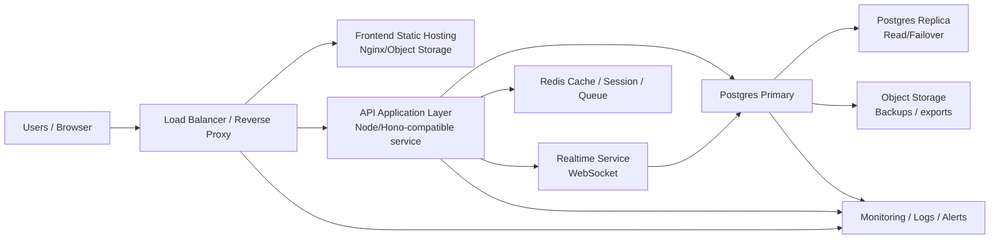

# MAXIWA KPI: ประเมิน Spec สำหรับ Private Cloud

เอกสารนี้ประเมินทรัพยากรระบบคลาวด์ส่วนตัวสำหรับ MAXIWA KPI โดยอ้างอิงจากสถาปัตยกรรมปัจจุบัน: frontend static app, API layer, Supabase/Postgres-compatible database, realtime task updates, audit log, และ workflow ตาม role

## 1. สมมติฐานการประเมิน

เนื่องจากยังไม่มีตัวเลข production workload จริง จึงประเมินจากลักษณะระบบและแบ่งเป็น 3 ระดับ

| รายการ | Small | Medium | Large |
|---|---:|---:|---:|
| ผู้ใช้ทั้งหมด | 50-150 | 150-500 | 500-1,500 |
| Concurrent users | 10-30 | 30-100 | 100-300 |
| Task records | 50k-200k | 200k-1M | 1M-5M |
| Audit log records | 100k-500k | 500k-3M | 3M-15M |
| Realtime updates | ต่ำ-กลาง | กลาง | สูง |
| Availability target | 99.5% | 99.9% | 99.9%+ |

## 2. Recommended Private Cloud Architecture

หลักการออกแบบ:
- แยก frontend, API, realtime, database, cache และ monitoring ออกจากกัน
- ใช้ Postgres เป็น system of record
- ใช้ Redis สำหรับ cache/session/queue เพื่อลดภาระ database
- มี database replica หรือ backup standby สำหรับงานอ่านหนักและ recovery
- วาง load balancer/reverse proxy เป็นจุดเข้าเดียวของระบบ

## 3. Spec แนะนำตามขนาดระบบ

### 3.1 Small Deployment

เหมาะสำหรับ pilot, department-level usage, หรือ UAT production parallel

| Component | Spec แนะนำ |
|---|---|
| Load Balancer / Reverse Proxy | 2 vCPU, 2-4 GB RAM, 30 GB disk |
| Frontend Static Host | 2 vCPU, 2 GB RAM, 30 GB disk |
| API Server | 2 vCPU, 4 GB RAM, 50 GB disk |
| Realtime Service | รวมกับ API ได้ในช่วงเริ่มต้น หรือแยก 2 vCPU, 4 GB RAM |
| PostgreSQL Primary | 4 vCPU, 16 GB RAM, 300-500 GB SSD/NVMe |
| PostgreSQL Replica / Standby | 4 vCPU, 16 GB RAM, 300-500 GB SSD/NVMe |
| Redis | 2 vCPU, 4 GB RAM, 30 GB disk |
| Backup Storage | 1-2 TB object/NAS storage |
| Monitoring | 2 vCPU, 4-8 GB RAM, 100 GB disk |

Minimum usable setup: 3-4 VMs  
Recommended setup: 6-8 VMs

### 3.2 Medium Deployment

เหมาะสำหรับใช้งานหลายทีมพร้อมกันและเริ่มเป็นระบบหลักขององค์กร

| Component | Spec แนะนำ |
|---|---|
| Load Balancer Cluster | 2 nodes, each 2-4 vCPU, 4 GB RAM |
| Frontend Static Hosts | 2 nodes, each 2 vCPU, 2-4 GB RAM |
| API Servers | 2-3 nodes, each 4 vCPU, 8-16 GB RAM |
| Realtime Service | 2 nodes, each 4 vCPU, 8 GB RAM |
| PostgreSQL Primary | 8 vCPU, 32-64 GB RAM, 1-2 TB NVMe/SSD |
| PostgreSQL Replica | 8 vCPU, 32-64 GB RAM, 1-2 TB NVMe/SSD |
| Redis HA | 2-3 nodes, each 2-4 vCPU, 8 GB RAM |
| Backup Storage | 3-5 TB object/NAS storage |
| Monitoring/Logging | 4 vCPU, 16 GB RAM, 500 GB-1 TB disk |

Recommended setup: 10-14 VMs

### 3.3 Large Deployment

เหมาะสำหรับ enterprise-wide rollout, concurrent สูง, audit log เยอะ, และต้องการ HA ชัดเจน

| Component | Spec แนะนำ |
|---|---|
| Load Balancer Cluster | 2-3 nodes, each 4 vCPU, 8 GB RAM |
| Frontend Static Hosts | 2-3 nodes, each 2-4 vCPU, 4 GB RAM |
| API Servers | 4-6 nodes, each 8 vCPU, 16-32 GB RAM |
| Realtime Service | 3 nodes, each 8 vCPU, 16 GB RAM |
| PostgreSQL Primary | 16 vCPU, 64-128 GB RAM, 3-5 TB NVMe |
| PostgreSQL Read Replicas | 1-2 nodes, each 16 vCPU, 64-128 GB RAM, 3-5 TB NVMe |
| Redis Cluster | 3 nodes, each 4-8 vCPU, 16 GB RAM |
| Backup Storage | 10 TB+ object/NAS storage |
| Monitoring/Logging/SIEM Forwarding | 8 vCPU, 32 GB RAM, 2 TB disk |

Recommended setup: 18-25 VMs

## 4. Database Sizing Notes

Database เป็นจุดที่ต้องให้ความสำคัญที่สุด เพราะระบบมี dashboard, report, task filtering, audit log และ job tracker

คำแนะนำ:
- ใช้ SSD/NVMe สำหรับ Postgres
- ตั้งค่า automated backup อย่างน้อยรายวัน และ point-in-time recovery ถ้าเป็นไปได้
- แยก storage สำหรับ WAL/archive logs
- ทำ index สำหรับ field ที่ใช้กรองบ่อย เช่น team, assignee/empid, status, start date, deadline, completion date, job code
- แยก audit log retention policy เช่น เก็บ online 2-3 ปี แล้ว archive
- สำหรับ report หนัก ควรพิจารณา read replica หรือ materialized summary ใน phase ถัดไป

## 5. Network และ Security

| Area | Recommendation |
|---|---|
| Network Zone | แยก public zone สำหรับ reverse proxy และ private zone สำหรับ API/DB |
| TLS | ใช้ HTTPS ทุก endpoint |
| Firewall | เปิดเฉพาะ port ที่จำเป็น เช่น 443, internal DB port เฉพาะ API subnet |
| Secrets | เก็บใน vault หรือ private cloud secret manager |
| Access Control | Admin access ผ่าน VPN/Bastion เท่านั้น |
| Database Access | ห้าม user/app operator เข้าฐานข้อมูลตรงสำหรับงานประจำ |
| Audit | เก็บ access log, API log, admin action log |
| Backup Security | encrypt at rest และจำกัดสิทธิ์ restore |

## 6. Monitoring ที่ควรมี

| Layer | Metric สำคัญ |
|---|---|
| Load Balancer | request rate, 4xx/5xx, latency p95/p99 |
| API | response time, error rate, timeout, memory, CPU |
| Realtime | active connections, reconnect rate, event delay |
| Postgres | CPU, RAM, IOPS, slow queries, lock, connection count, replication lag |
| Redis | memory usage, evictions, command latency |
| Storage | disk usage, backup success, WAL/archive growth |
| Business Health | login success, task create/update success, dashboard load time, report generation time |

## 7. Backup และ DR

| Target | Small | Medium | Large |
|---|---|---|---|
| Backup frequency | Daily full + WAL if available | Daily full + PITR | PITR + tested restore drill |
| RPO | 24 hours | 1-4 hours | 15-60 minutes |
| RTO | 4-8 hours | 2-4 hours | 1-2 hours |
| DR environment | Manual restore | Warm standby | Warm/hot standby |
| Restore test | Quarterly | Monthly/Quarterly | Monthly |

## 8. Spec ที่แนะนำสำหรับเริ่ม Production

ถ้าต้องเลือก baseline ที่ปลอดภัยสำหรับการใช้งานจริง ผมแนะนำเริ่มที่ Medium-lite:

| Component | Recommended Baseline |
|---|---|
| Load Balancer | 2 nodes, 2 vCPU, 4 GB RAM |
| Frontend | 2 nodes, 2 vCPU, 2 GB RAM |
| API | 2 nodes, 4 vCPU, 8-16 GB RAM |
| Realtime | 1-2 nodes, 4 vCPU, 8 GB RAM |
| PostgreSQL Primary | 8 vCPU, 32 GB RAM, 1 TB NVMe/SSD |
| PostgreSQL Replica | 8 vCPU, 32 GB RAM, 1 TB NVMe/SSD |
| Redis | 2 nodes, 2-4 vCPU, 8 GB RAM |
| Monitoring/Logging | 4 vCPU, 16 GB RAM, 500 GB disk |
| Backup Storage | 3 TB |

เหมาะกับ concurrent users ประมาณ 30-100 คน และ task records หลักแสนถึงประมาณ 1 ล้านรายการ โดยยังมีพื้นที่ให้ scale เพิ่ม

## 9. สิ่งที่ต้องเก็บข้อมูลเพิ่มเพื่อ sizing ให้แม่น

ก่อนสรุปงบลงทุน ควรเก็บตัวเลขเหล่านี้จากระบบเดิม:
- จำนวนผู้ใช้ทั้งหมดและ peak concurrent users
- จำนวน task ต่อวัน/เดือน
- จำนวน audit log ต่อ task โดยเฉลี่ย
- ขนาดฐานข้อมูลปัจจุบันและอัตราโตต่อเดือน
- query/report ที่ช้าที่สุด 10 อันดับแรก
- SLA เป้าหมายของระบบ เช่น 99.5%, 99.9%, หรือ 99.95%
- retention policy ของ task และ audit log
- ความต้องการ DR: RPO/RTO ที่ผู้บริหารยอมรับได้

## 10. ข้อเสนอสำหรับผู้บริหาร

เริ่มใช้งานจริงด้วย Medium-lite private cloud spec เพื่อบาลานซ์ต้นทุนและความเสี่ยง จากนั้นวัด workload จริง 30-60 วัน แล้วค่อย scale API/realtime/database ตามข้อมูลจริง

แนวทางนี้เหมาะกับ MAXIWA KPI เพราะ Release 1 เน้น compatibility กับระบบเดิม การลงทุนควรให้หนักที่ database reliability, backup, monitoring และ UAT มากกว่าการ overprovision application server ตั้งแต่วันแรก

